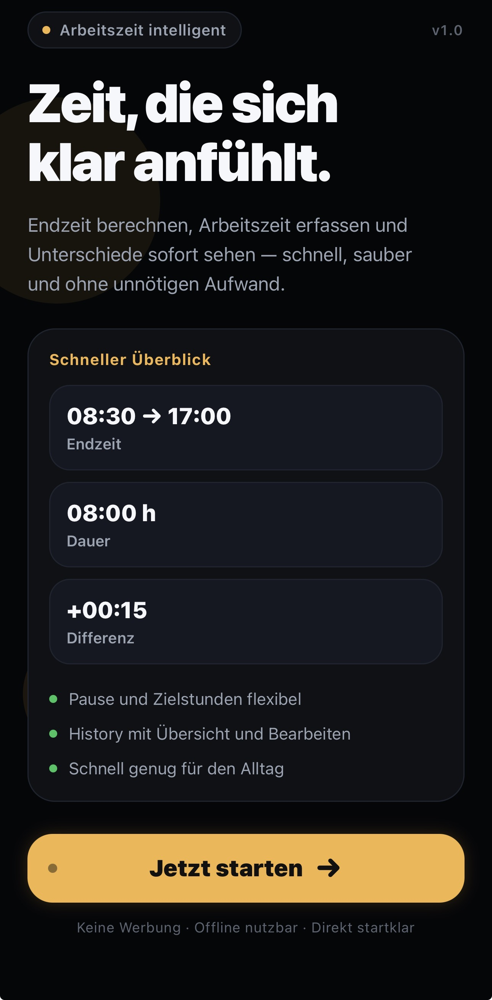
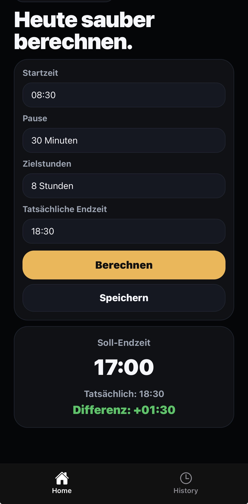
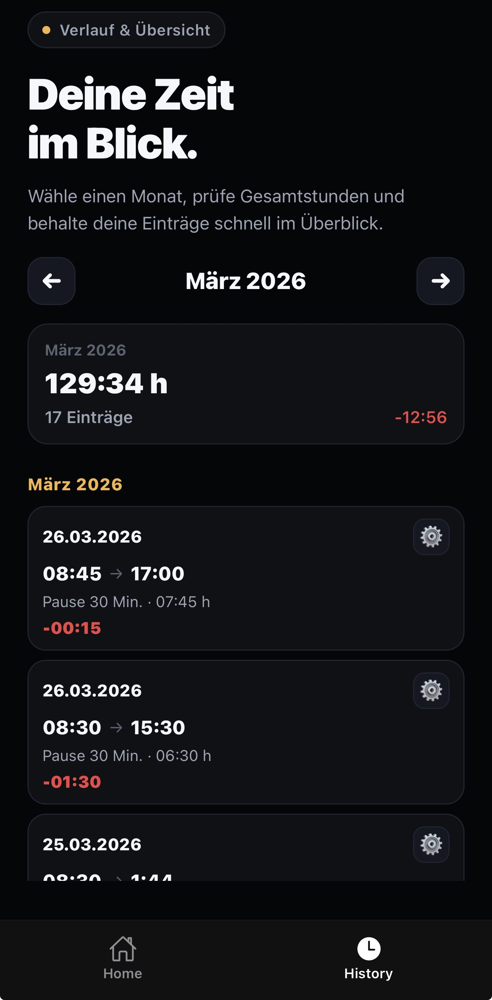
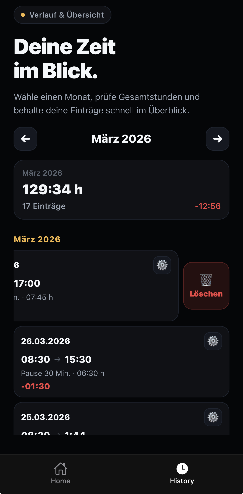

# Arbeitszeit Rechner ⏱️

A clean, fast mobile app to calculate working hours, track overtime, and manage your daily work entries — built with React Native and Expo.

<br />

## 💡 Idea Behind the App

Most people don't track their working hours until they realize they've been working overtime for weeks without noticing. This app was built to solve that in the simplest way possible: open it, enter your start time and break, and instantly know when you should leave — and whether you stayed too long.

No account needed. No cloud sync. Just a practical tool for everyday use.

<br />

## 📸 Screenshots

| Start Screen | Home Screen | History | Swipe Delete |
|---|---|---|---|
|  |  |  |  |

<br />

## ✨ Features

- **Plan your day** — Enter start time, break duration, and target hours to calculate your planned end time
- **Track actuals** — Log when you actually stopped working
- **Overtime at a glance** — Difference between planned and actual time is calculated automatically
- **Local storage** — All entries are saved privately on your device using AsyncStorage
- **Monthly overview** — See total hours worked and entry count per month
- **Full history** — Browse all past entries, grouped by month
- **Edit entries** — Update any saved entry at any time
- **Swipe to delete** — Remove entries quickly with a swipe gesture
- **Dark UI** — Clean, minimal design built for daily use

<br />

## 🛠️ Tech Stack

| Technology | Purpose |
|---|---|
| React Native (Expo) | Cross-platform mobile framework |
| TypeScript | Type-safe development |
| Expo Router | File-based navigation |
| AsyncStorage | Local on-device persistence |
| Custom Hooks | Reusable state & logic |
| Component Architecture | Scalable, maintainable structure |

<br />

## 📁 Project Structure

```
├── app/                  # Screens & routing (Expo Router)
├── components/           # Shared UI components
│   └── history/          # History-specific components
├── hooks/                # Custom React hooks
├── storage/              # AsyncStorage logic
└── utils/                # Helper functions & time calculations
```

<br />

## 🚀 Getting Started

**Prerequisites:** Node.js, Expo CLI, and the Expo Go app on your phone.

```bash
# Clone the repository
git clone https://github.com/FerasHB/arbeitszeit-rechner.git

# Install dependencies
cd arbeitszeit-rechner
npm install

# Start the development server
npx expo start
```

Scan the QR code with Expo Go (Android) or the Camera app (iOS) to run the app on your device.

<br />

## 👤 Author

**Feras Hababa**

- GitHub: [@FerasHB](https://github.com/FerasHB)
- LinkedIn: [feras-hababa](https://www.linkedin.com/in/feras-hababa-a9227b337/)

<br />

## 📄 License

This project is licensed under the [MIT License](./LICENSE).